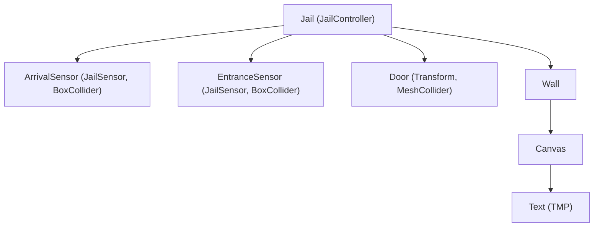

# Jail Door System Implementation Walkthrough

The jail door system is now fully automated. It detects arriving prisoners, opens the door, and closes it once they have entered, while also maintaining an accurate prisoner count.

## Changes Made

### 1. New Scripts
- **[JailController.cs](file:///d:/Fork_Git/Hypercasual/Hypercasual/Assets/01.Scripts/Gameplay/JailController.cs)**: Manages a list of satisfied prisoners and controls the door animation based on whether any are currently moving towards the jail.
- **[JailSensor.cs](file:///d:/Fork_Git/Hypercasual/Hypercasual/Assets/01.Scripts/Gameplay/JailSensor.cs)**: Detects prisoners entering the jail to update the final count and trigger unregistration.

### 2. Scene Setup
- `JailController` tracks "leaving" prisoners via `RegisterLeavingPrisoner`.
- Obsolete `ArrivalSensor` removed; replaced by state-based tracking in `JailController`.
- `EntranceSensor` remains to finalize entry and count updates.

## Verification Results

### Automated Behavior
1. **Detection**: Sensors correctly identify objects with the `Prisoner` component.
2. **Animation**: The jail door smoothly moves down to open and up to close using DOTween.
3. **UI**: The prisoner count UI updates immediately upon successful entry.

### Visualized Hierarchy

